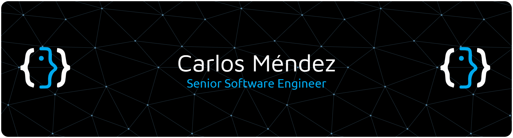

# 👨‍💻 Acerca de mí:
Soy un Desarrollador Full Stack con más de 9 años de trayectoria en los sectores público y privado, especializado en Laravel, WordPress y Sistemas de Información Geográfica (SIG). Me apasiona transformar las necesidades de negocio en soluciones tecnológicas robustas y centradas en el usuario.  A lo largo de mi carrera, he diseñado y desarrollado una amplia gama de aplicaciones, incluyendo: * Geoportales interactivos y plataformas para el seguimiento de obras públicas. * Sistemas de pago en línea para servicios municipales, con integración de pasarelas bancarias. * Plataformas de E-Learning completas, desde la gestión de cursos hasta la emisión de certificados.  Mi experiencia abarca tanto el backend como el frontend, así como la configuración de servidores Linux y la administración de bases de datos (MySQL, PostgreSQL).  Actualmente, estoy enfocado en mi crecimiento hacia un perfil Senior, profundizando en pruebas automatizadas, arquitectura limpia, CI/CD, Docker y AWS. Busco colaborar en proyectos desafiantes donde pueda aplicar mi experiencia y seguir aprendiendo para ofrecer soluciones de vanguardia.  Tecnologías Clave: Laravel, PHP, React, JavaScript, MySQL, PostgreSQL, GeoServer, OpenLayers, Git, APIs REST.  Habilidades Blandas: Pensamiento crítico y analítico, Comunicación efectiva, Gestión y resolución de problemas, Trabajo en equipo, Adaptabilidad y resiliencia, Proactividad e innovación.

## 🌐 Sociales:
  

## 💻 Stack Tecnológico
                         

<!--
**cemendez/cemendez** is a ✨ _special_ ✨ repository because its `README.md` (this file) appears on your GitHub profile.

Here are some ideas to get you started:

- 🔭 I’m currently working on ...
- 🌱 I’m currently learning ...
- 👯 I’m looking to collaborate on ...
- 🤔 I’m looking for help with ...
- 💬 Ask me about ...
- 📫 How to reach me: ...
- 😄 Pronouns: ...
- ⚡ Fun fact: ...
-->
